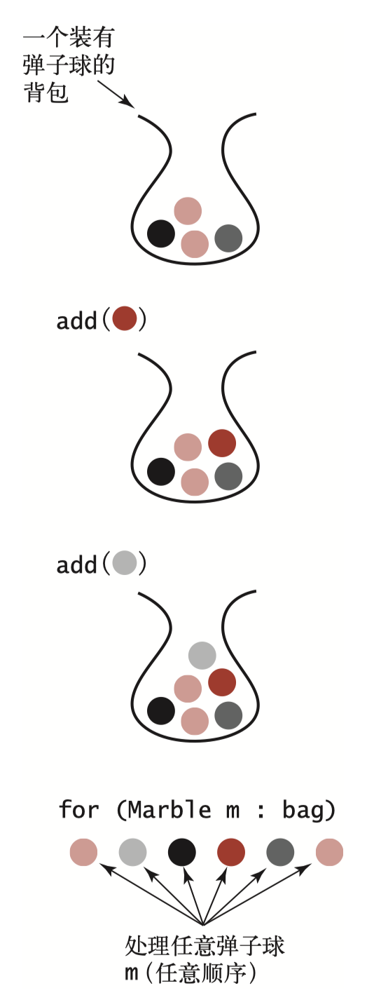
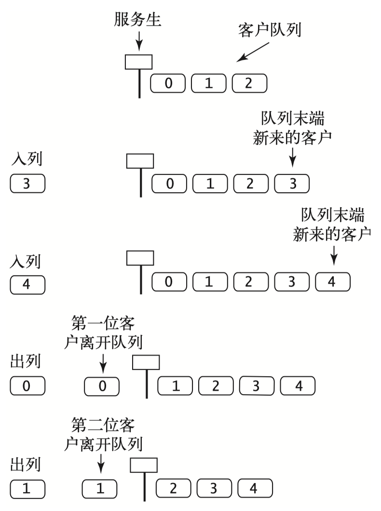
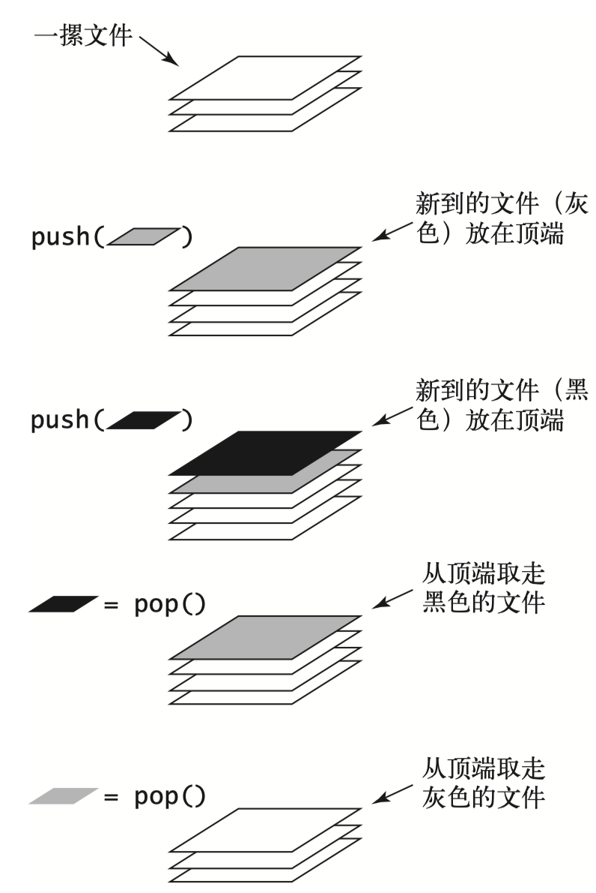

基础算法
===

## 二分查找 - BinarySearch

> 问题描述：给定一个有序数组，从数组中查找一个元素key，返回key的下标（不存在时返回-1）。

[算法演示](https://zhuanlan.zhihu.com/p/139579615)

代码实现：[BinarySearch](../src/main/java/pers/yibo/algorithms/fundamentals/BinarySearch.java)

[算法复杂度](https://www.jianshu.com/p/4fe210d7acdf)：时间复杂度为`O(logN)`，最多经历log2(N)+1次步骤之后，可以获得查找的结果。

## 背包 - Bag

> 描述：背包是一种**不支持从中删除元素**的集合数据类型——它的 目的就是帮助用例收集元素并迭代遍历所有收集到的元素（用 例也可以检查背包是否为空或者获取背包中元素的数量）。

要理解背包的概念， 可以想象一个非常喜欢收集弹子球的人。他将所有的弹子球都放在一个背包里，一次一个，并且会不时在所有的弹子球中寻找某一颗拥有某种特点的弹子球。

实现逻辑：后进先出链表，不支持删除元素。

代码实现：[Bag](../src/main/java/pers/yibo/algorithms/fundamentals/Bag.java)

## 队列 - Queue

先进先出队列（或简称队列）是一种基于先进先出（FIFO）策略的集合类型。

代码实现：[Queue](../src/main/java/pers/yibo/algorithms/fundamentals/Queue.java)

## 栈 - Stack

下压栈（或简称栈）是一种基于后进先出（LIFO）策略的集合类型。

代码实现：[Stack](../src/main/java/pers/yibo/algorithms/fundamentals/Stack.java)